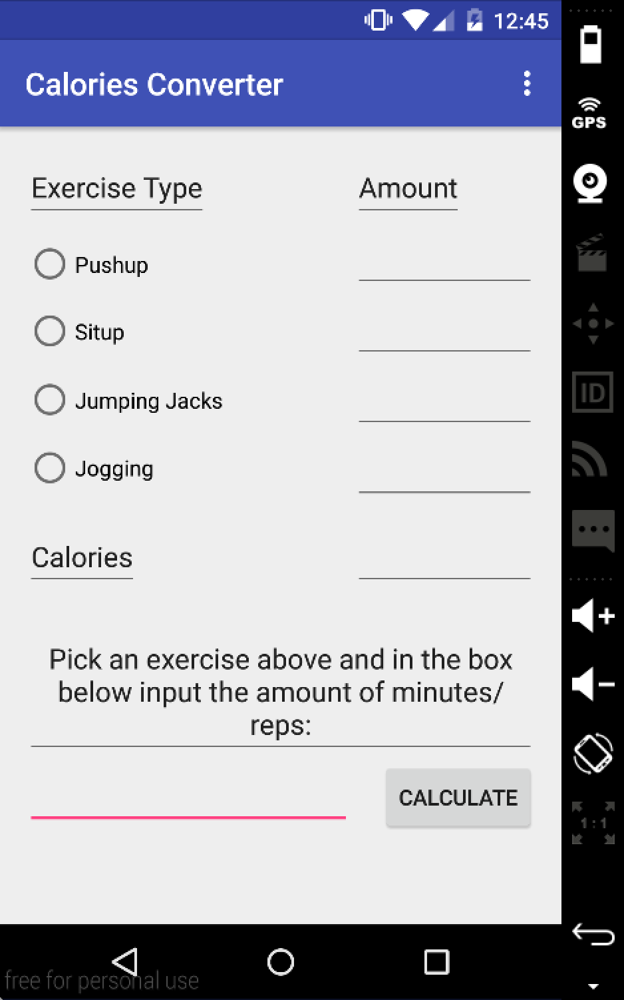
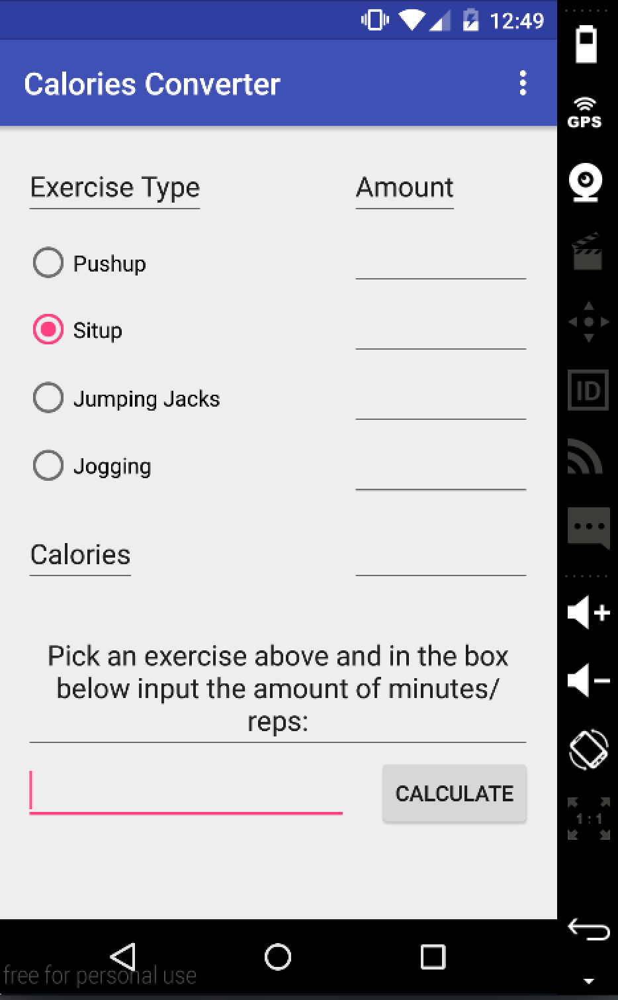
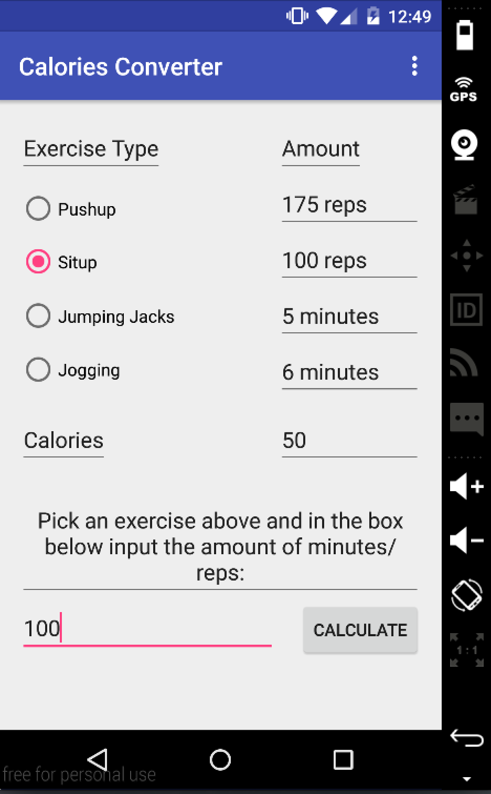
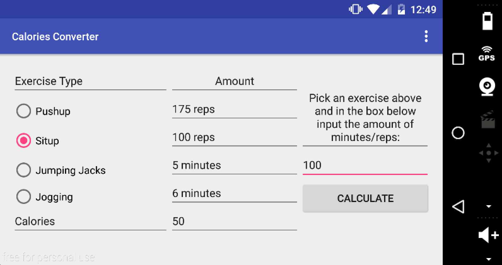

# PROG 01: Crunch Time

My app is called Calories Converter. It allows the user to convert an amount of a specific type of exercise into calories and then displays the calories and also the amount of other exercsies necessary to reach the same amount of calories burned. The app is able to be viewed in portrait or landscape and retain functionality in both views. 

## Authors

Ellen Omoto ([ellen_omoto@berkeley.edu](mailto:ellen_omoto@berkeley.edu))

## Demo Video

See [Project 01 Demo Video] (https://youtu.be/HjV5Qgu4I04)

## Screenshots

## Acknowledgments

* Hat tip to anyone who's code was used
* Any other support

